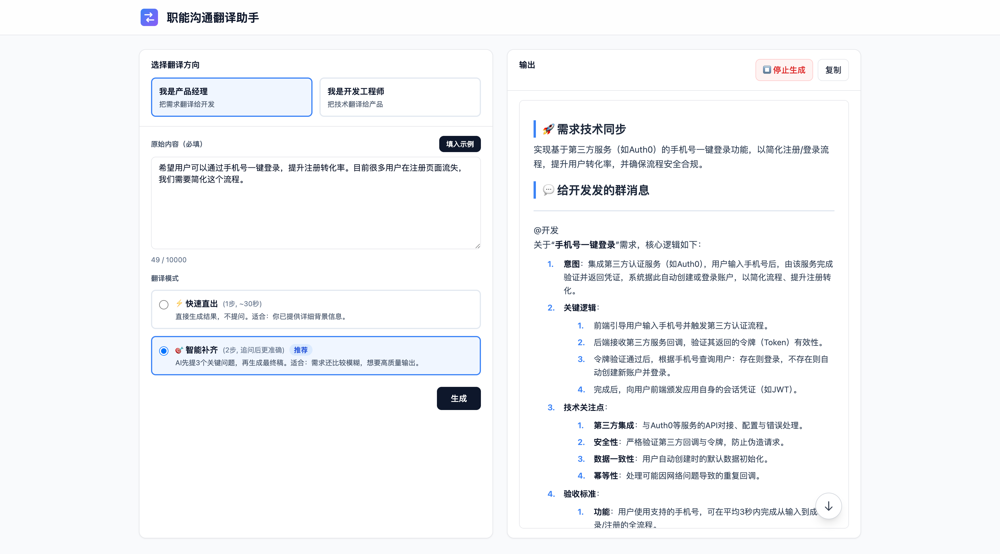

# 职能沟通翻译助手 (Role Translator)

帮助产品经理和开发工程师更好地理解彼此的沟通翻译工具。

## 快速开始

### 1. 安装依赖

```bash
npm install
```

### 2. 配置环境变量

在项目根目录创建 `.env` 文件：

```bash
cp .env.example .env
```

```bash
# 必填：API 密钥
LLM_API_KEY=sk-xxxxxxxxxxxxxxxx

# 必填：API 基础地址
LLM_API_BASE_URL=https://api.openai.com/v1

# 选填：模型名称（默认 gpt-4o）
LLM_MODEL=gpt-4o
```

### 3. 运行项目

```bash
# 开发模式（热重载）
npm run dev

# 生产模式
npm start
```

打开浏览器访问 `http://localhost:3000`

---

## 项目结构

```text
role-translator/
├── public/                  # 前端静态资源
│   ├── index.html           # 主页面
│   └── app.js               # 前端逻辑
├── server/                  # 后端服务
│   ├── index.js             # Express 入口
│   ├── translators/         # 翻译器实现
│   │   ├── direct-translator.js      # 直出模式
│   │   └── interactive-translator.js # 交互模式
│   ├── prompts/             # 提示词库
│   │   └── prompts.js       # 核心 System Prompts
│   ├── middleware/          # Express 中间件
│   │   ├── sse.js           # SSE 流式响应
│   │   └── validation.js    # 请求验证
│   └── utils/               # 工具模块
│       ├── constants.js     # 常量定义
│       └── logger.js        # 日志工具
├── .env.example             # 环境变量示例
└── README.md
```

---

## 功能说明

### 这个工具做什么？

在企业协作中，产品经理关注用户价值和商业目标，开发工程师关注技术实现和工作量评估。这种视角差异经常导致沟通障碍。

本工具通过 AI 实现双向翻译：
- **产品 → 开发**：将模糊的业务需求转化为包含技术细节、边界条件、性能要求的技术语言
- **开发 → 产品**：将技术实现成果转化为体现业务价值、用户体验提升的业务语言

### 核心功能

1. **快速直出模式**：一步生成完整翻译结果，适合信息较完整的场景
2. **智能补齐模式**：AI 先识别缺失信息并提问，用户补充后再生成更准确的结果
3. **流式输出**：实时显示 AI 生成过程，体验更流畅
4. **一键复制**：生成的群消息可直接复制到 IM 工具中使用

## 产品截图


## 测试用例

详细的测试用例和示例输出请查看 [EXAMPLES.md](./EXAMPLES.md)。

---

## 提示词设计说明

提示词设计的目标不是“把中文换一种说法”，而是实现**跨职能语义对齐**：把同一句话在“产品语言”和“技术语言”之间做**信息结构重构**，让输出能直接用于**业务决策（给产品）**或**技术评估与落地（给开发）**。因此整体采用 **「角色沉浸 + 结构化分析（Analysis）+ 合成生成（Synthesis）+ 默认假设兜底」** 的组合策略

---

### 一、如何让 AI 理解「产品视角」与「开发视角」的差异？

#### 1) 角色设定：先定岗，再输出
为了让模型一开始就进入对应的“工作脑”，针对两个方向分别给了明确、强约束的专家身份：

- **PM → Dev**：AI 扮演「资深技术架构师 / Tech Lead」  
  目标是把模糊需求拆成开发可评估、可落地的任务包，重点关注：**数据来源、异常边界、性能指标、外部依赖、验收口径、排期复杂度**。

- **Dev → PM**：AI 扮演「懂业务的技术负责人」  
  目标是把技术方案/成果翻译成产品可决策的信息，重点关注：**用户可感知变化、业务指标映射、商业收益空间、风险与上线策略、需要产品配合的事项**。

> 核心点：不让模型“自由发挥理解差异”，而是通过 System Prompt 的角色与任务定义，强制改变注意力分配与输出取舍。

---

#### 2) 关注点映射：把抽象词翻译成对方能用的“工作语言”
提示词里内置了语义转换的方向性：同样一句话，在不同角色语境下应该落到不同维度。

| 输入表达（常见口语） | PM → Dev（技术落地语言） | Dev → PM（业务可感知语言） |
|---|---|---|
| “快 / 稳” | QPS、Latency、SLA、错误率、降级策略 | 页面秒开、操作流畅、稳定不转圈 |
| “提升体验” | 缓存策略、接口优化、链路治理、埋点口径 | 满意度提升、留存/转化改善（合理假设） |
| “重构代码” | 技术债务、模块解耦、边界收敛、回归范围 | 迭代速度更快、维护成本下降、故障风险降低 |

> 核心点：把沟通从“主观表达”提升为“可对齐口径”，让对方能继续推进工作（评估 / 排期 / 决策）。

---

#### 3) 结构化输出：把对方的工作流写进答案里
为了让结果更接近真实协作产物，输出被强制成三层：

- **群消息片段**：短句、结论先行、行动点明确，可直接粘贴到 IM 群里  
- **深度解析**：对技术/业务做结构化拆解，支撑评审与排期  
- **默认假设**：信息不足时按行业标准补齐，而不是反复追问导致流程卡住

> 核心点：模板不是为了“好看”，而是为了让输出能直接进入下一步协作动作。

---

### 二、提示词里的关键设计点是什么？

为了保证输出的**稳定性**与**实用性**，关键机制被写进提示词与结构里，尽量减少发散与随机性。

#### 1) 「角色 + 任务 + 硬规则」三段式 System Prompt
- **Role**：明确扮演谁（Tech Lead / 懂业务的技术负责人）  
- **Task**：明确要把输入重构成对方可用的语言（可评估 / 可决策）  
- **Rules**：明确不可违背的约束。

> 价值点：让模型输出从“解释型回答”变成“交付型产物”。

---

#### 2) 两阶段架构（Analysis → Synthesis）：先识别缺口，再生成结果
翻译任务被拆成两步，避免一上来就生成“看似完整但不可用”的长文：

- **Analysis（分析缺口）**：通过 `ANALYSIS_JSON_SCHEMA_BASE` 强制输出严格 JSON  
  目的不是格式化，而是强迫模型先结构化思考：提炼 `logic_core`，列出 `missing_info`（最多 3 个且按阻塞优先级排序），并给出 `confidence_score` / `can_proceed_directly`。

- **Synthesis（合成回复）**：在缺口与假设清晰后，再按输出结构生成最终的“对方语言”。

> 价值点：把不确定性收敛成可控中间态，输出更稳，也更方便工程侧做流程编排（是否需要补充信息、是否可直接生成）。

---

#### 3) 默认假设兜底：拒绝留白，保证能推进
现实里用户经常补不齐细节，如果 AI 一直追问，体验会很差。为了解决这个问题：

- 在 JSON Schema 中设置 `default_assumption` 字段，要求每个缺口给出一个行业基线  
- 在 Synthesis 阶段明确硬规则：  
  - **事实来源优先级**：用户回答 > 默认假设 > 原始输入  
  - **拒绝留白**：用户不答就直接采用默认假设，不再追问

> 价值点：即使输入很简短，也能基于 Best Practices 产出可用内容，并且把“基于哪些假设推导”说清楚，方便后续对齐与修正。

---

#### 4) IM 友好的场景化输出：让结果能直接发群
相比生成长篇报告，更高频的使用场景其实是“发一段能推动协作的群消息”。因此输出结构里固定了：

- “一句话核心”先把结论讲清楚  
- “@开发 / @产品”的群消息格式，条列关键点，强调可执行性  
- 同时保留“深度解析”，兼顾快速同步与深入评审

> 价值点：输出天然就是沟通素材，可直接复制粘贴，落地感更强。